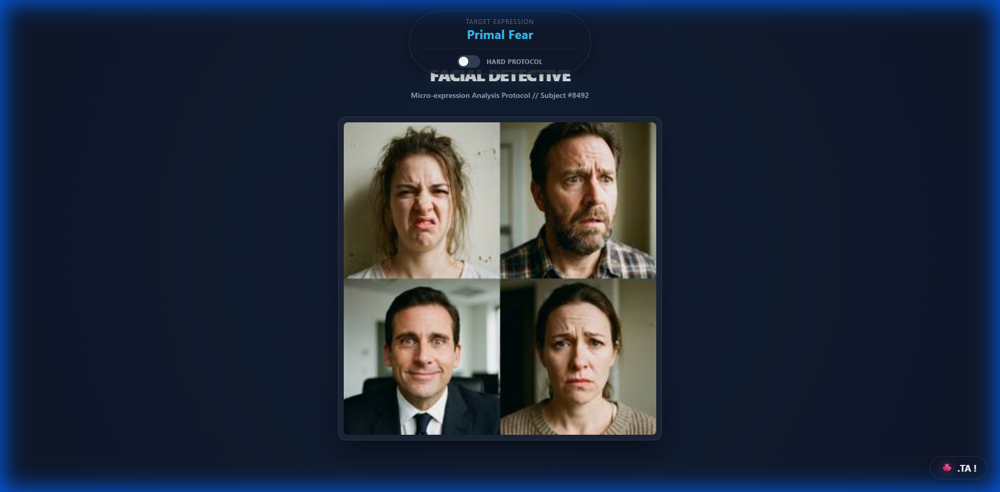

# Facial Detective | Micro-Expression Analysis Protocol

**Facial Detective** is a gamified training tool designed to test and improve your ability to identify subtle human micro-expressions. Originally developed as a standalone browser-based drill, it challenges users to spot specific emotional cues—ranging from basic "Primal Fear" to complex "Muted Arrogance"—under time pressure.



## 🎯 Objectives

The protocol is simple but demanding:
1.  **Analyze** the target expression displayed on the HUD (e.g., "Masked Sadness").
2.  **Scan** the 4-panel grid of faces.
3.  **Identify** the correct match before your instinct fails you.

### Modes
*   **Standard Protocol:** Correct guesses pause the game, allowing you to study the specific facial muscle movements (Action Units) explained in the feedback. Tap anywhere to continue.
*   **HARD PROTOCOL:** A toggleable stress test. You have **5 seconds** per face to make a decision. Auto-advances rapidly. Hesitation is failure.

## 🧠 Features

*   **100% Client-Side:** No backend servers or databases. The entire logic lives in `script.js`.
*   **Embedded Assets:** All high-quality image grids are Base64 encoded directly into the code, making the app single-file portable and instant-loading.
*   **Dynamic Scenarios:** Includes diverse datasets:
    *   *Basic Emotions* (Fear, Disgust, Anger)
    *   *Deception* (Fake Smiles, Contempt)
    *   *Leadership* (Arrogance, Engagement)
    *   *Micro-expressions* (Suppressed Anger, Fear Leakage)
*   **Performance Tracking:** Tracks your "Performance Rating" and "Historical Best" via local browser storage. Generates a post-game report of missed expressions for review.

## 🛠️ Installation & Usage

You can play the live version here: **[https://tarigha.github.io/faces/](https://tarigha.github.io/faces/)**

### Local Development
To run this locally or improve upon it:

1.  **Clone the repository:**
    ```bash
    git clone https://github.com/Tarigha/faces.git
    ```
2.  **Open the folder:**
    navigate to the folder.
3.  **Run:**
    simply double-click `index.html`. No `npm install`, build steps, or servers required.

## 🤝 How to Contribute

This project is open for community improvements! We successfully "fixed" the initial prototype by removing text labels from images to prevent cheating—now we rely on pure visual analysis.

**Areas for improvement:**
*   **New Image Sets:** Generate or photograph new 2x2 grids of faces. You can inject them into `GAME_DATA` in `script.js`.
*   **Mobile Layout:** While responsive, the touch targets could be optimized further for thumbs.
*   **Accessibility:** Adding keyboard navigation (1-4 keys) for desktop power users.

### Adding New Levels
Look at `script.js`. The `GAME_DATA` object contains `assets` (images) and `levels` (logic). 
1.  Add your Base64 image string to `assets`.
2.  Add a new level block to `levels` referencing that asset set.

## 📝 License

This project is open source. Feel free to fork, modify, and use it for your own training protocols.

---
*Subject #8492 // Session Logged.*
